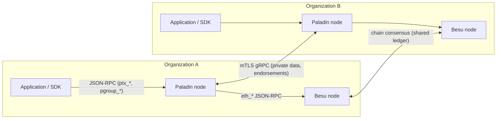
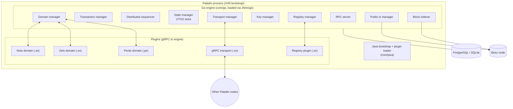

# Chapter 2 — Architecture Overview

## 2.1 The sidecar model

A Paladin deployment is a network of **nodes**. Each node is operated by one organization and
pairs two processes:

1. A **base-ledger node** — today a Hyperledger Besu EVM node participating in the shared chain.
2. A **Paladin runtime** — the privacy engine this repository builds.

Applications never talk to the chain directly; they talk to Paladin's JSON-RPC API. Paladin talks
to *its* peers over a private, mutually-authenticated gRPC mesh, and to the chain via the local
base-ledger node's JSON-RPC endpoint.

Two networks, two kinds of truth:

- The **base ledger** carries *ordering, double-spend prevention, and finality* — as opaque
  32-byte state identifiers, signatures, and proofs.
- The **Paladin mesh** carries *data* — the actual state contents, endorsement requests, and
  coordination messages — delivered only to entitled parties, with reliable (persisted,
  retried, acknowledged) delivery semantics.

## 2.2 The three ledger layers

Paladin's documentation (`doc-site/docs/architecture/ledger_layers.md`) frames the system as three
layers on one chain:

1. **The shared base ledger** — global, totally ordered, sees only commitments
   (hashes of states), nullifiers/spend markers, and verification data (signatures, ZK proofs).
2. **The selective-disclosure layer** — Paladin's off-chain state store plus the peer-to-peer
   distribution machinery. Every private state exists here in full, but only on the nodes of the
   parties in its distribution list. A state's on-chain identifier is a hash of its content, so
   any holder can prove what they hold against the chain.
3. **The programming layer** — the domains, which decide what a "transaction" means: token
   transfer rules (Noto/Zeto) or arbitrary EVM execution inside a **privacy group** (Pente).

## 2.3 Node anatomy

Inside one Paladin node:

Key facts about this shape (details in chapters 3 and 5):

- **The runnable process is a JVM.** `core/java` starts up, loads the Go engine as a native
  shared library over **JNA** (Java Native Access — a Java↔C bridge), and hosts the plugin
  loader. This lets Go plugins load as C-shared libraries and Java plugins (Pente) load as JARs
  inside one process, all speaking the same gRPC protocol to the engine over a local socket.
- **Everything stateful lives in SQL** (PostgreSQL in production, SQLite for tests) — states,
  transactions, indexed blocks, reliable-message queues — so a node restart resumes exactly
  where it left off.
- **Plugins are processes-within-the-process**: they communicate with the engine exclusively via
  protobuf messages over gRPC (`toolkit/proto/protos/`), which is precisely what makes the
  engine portable — a plugin does not care what language the engine is in, and mostly does not
  care what chain it anchors to (chapter 11 exploits this).

## 2.4 The repository at a glance

| Directory | Contents | Language |
|---|---|---|
| `core/go` | The engine: all managers, block indexer, eth client, persistence | Go |
| `core/java` | Process bootstrap, JNA bridge, plugin loader | Java |
| `toolkit/proto` | The protobuf contract between engine and plugins | protobuf |
| `toolkit/go`, `toolkit/java` | Plugin-author SDKs (`plugintk`), signer library, RPC server | Go / Java |
| `config` | Configuration structs (`pldconf`) | Go |
| `domains/noto`, `domains/zeto` | Reference token domains | Go |
| `domains/pente` | Private-EVM domain (embeds the Besu EVM) | Java |
| `registries/static`, `registries/evm` | Identity/endpoint registry plugins | Go |
| `transports/grpc` | The mTLS node-to-node transport plugin | Go |
| `signingmodules/example` | Example remote-signing plugin | Go |
| `solidity` | On-chain contracts (Noto, Pente, Atom, registries) | Solidity |
| `sdk/go`, `sdk/typescript` | Client SDKs | Go / TS |
| `operator` | Kubernetes operator + Helm charts (CRDs for Paladin & Besu nodes) | Go |
| `examples`, `doc-site`, `testinfra` | Tutorials, documentation, docker test infra | mixed |

Build orchestration is **Gradle** across all languages, with Go modules stitched by `go.work`,
Solidity compiled by Hardhat, and TypeScript via npm.

## 2.5 Where the EVM actually lives

A theme that matters enormously for Part 2: the EVM coupling is *concentrated*, not smeared.
Four places in the engine know they are talking to an EVM chain:

1. `core/go/pkg/ethclient` — the JSON-RPC client that builds, signs (RLP/EIP-1559), and submits
   Ethereum transactions.
2. `core/go/pkg/blockindexer` — block/receipt/event ingestion from the chain.
3. `core/go/internal/publictxmgr` — nonce assignment, gas pricing, resubmission.
4. The **types and protobufs** — 20-byte `EthAddress`, ABI-encoded function calls, and
   keccak-topic events baked into shared types (`sdk/go/pkg/pldtypes`) and the plugin contract.

Everything else — the sequencer, the state store, the transport mesh, registries, key management,
privacy groups — is chain-agnostic machinery that Part 2 reuses as-is. Chapter 11 turns this
observation into the Base Ledger Interface.

---

*Next: [Chapter 3 — Runtime & components](03-runtime-and-components.md)*
