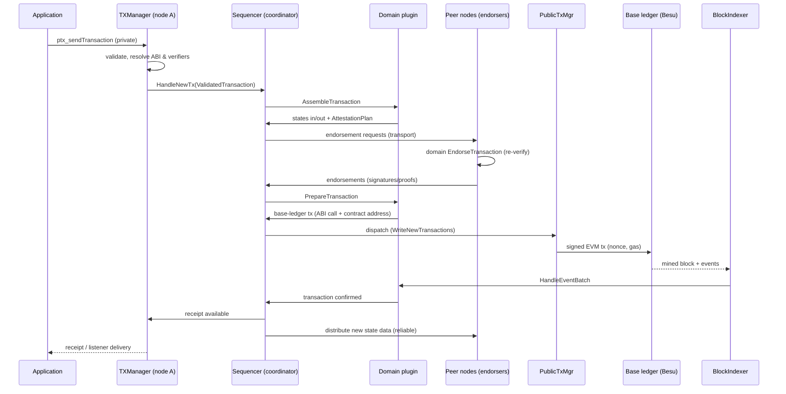

# Chapter 4 — The Private Transaction Lifecycle

This chapter follows one private transaction from an application's RPC call to finalized states —
the single most important flow in Paladin, and the one Part 2 must preserve intact while swapping
the chain underneath it.

## 4.1 The exchange object

The whole lifecycle revolves around one struct: **`PrivateTransaction`**
(`core/go/internal/components/transaction.go:85`) — described in its own comment as *"the critical
exchange object … as it hops between the states in the state machine (on multiple Paladin
nodes)"*. It carries:

- `PreAssembly` (`TransactionPreAssembly`, transaction.go:38) — the resolved inputs: function,
  parameters, resolved verifiers of all parties.
- `PostAssembly` (`TransactionPostAssembly`, transaction.go:66) — what the domain produced:
  `InputStates`, `ReadStates`, `OutputStates`, `InfoStates`, the **`AttestationPlan`** (what
  signatures/proofs/endorsements are still required), and the accumulating `Signatures` and
  `Endorsements`.

## 4.2 End-to-end sequence

Step by step:

1. **Submit.** `ptx_sendTransaction` with `"type": "private"`, a target domain contract, an ABI
   function, and JSON inputs. `TXManager.SendTransactions` validates, stores, and hands a
   `ValidatedTransaction` to the sequencer (`SequencerManager.HandleNewTx`,
   `components/sequencermgr.go:73`).

2. **Assemble.** The sequencer routes the transaction to the current **coordinator** for that
   contract (see 4.3), which calls the domain's `AssembleTransaction`. The domain queries
   available states through the `FindAvailableStates` callback into the engine's
   `DomainContext` (in-memory, lock-aware — chapter 3), selects inputs, computes outputs, and
   returns them with an **attestation plan** (e.g. Noto: "the notary must sign the EIP-712 hash
   of this transfer"; Pente: "all group members must endorse"; Zeto: "the sender must produce a
   Groth16 proof"). Assembly happens **on the transaction sender's node** — private data never
   leaves parties' nodes un-encrypted.

3. **Endorse.** The coordinator gathers what the plan requires: local signatures via the key
   manager, remote **endorsements** by sending the (data-bearing) transaction to each endorser
   node over the transport, where *their* domain plugin re-executes/validates
   (`EndorseTransaction`) and returns a signature. Endorsement dependencies and ordering across
   in-flight transactions are tracked by a dependency grapher
   (`internal/sequencer/coordinator/grapher/`).

4. **Prepare.** With attestations complete, the domain's `PrepareTransaction` produces the
   **base-ledger transaction**: for EVM, an ABI function call (e.g.
   `Noto.transfer(txId, inputs, outputs, signature, data)`) against the domain's on-chain
   contract. It may instead produce another *private* transaction (chained flows), or — when the
   caller asked to *prepare* rather than submit — the encoded call is returned to the application
   (`ptx_getPreparedTransaction`), the primitive behind atomic swaps (chapter 7).

5. **Dispatch & submit.** The coordinator's dispatch loop
   (`internal/sequencer/coordinator/dispatch_loop.go`, `internal/sequencer/syncpoints/`) writes
   the prepared public transaction to the **public tx manager**, which assigns a nonce, prices
   gas, signs — typically with an **anonymous one-time submission key**, so chain observers
   cannot correlate submitter identity — and submits, resubmitting with escalated fees if stuck.

6. **Confirm.** The block indexer sees the mined transaction and its events;
   `MatchUpdateConfirmedTransactions` correlates them to in-flight submissions; the domain
   receives `HandleEventBatch` and reports which private transactions are complete
   (`SequencerManager.PrivateTransactionsConfirmed`).

7. **Finalize & distribute.** The state manager records finalizations (inputs spent, outputs
   confirmed). The sequencer builds **state distributions**
   (`BuildStateDistributions`, sequencermgr.go:44-66) — which party receives which new state —
   and sends the full state data via `TransportManager.SendReliable` (persisted and retried
   until acknowledged, surviving restarts). Receipts flow to listeners.

## 4.3 The distributed sequencer

Documentation: `doc-site/docs/architecture/distributed_sequencer_*.md` (overview, architecture,
protocol, data flows, dependency handling, state machines). Implementation:
`core/go/internal/sequencer/`.

The problem it solves: UTXO models make *concurrent spending* hard — two transactions racing to
spend the same state means one must fail (a **double-spend race**). Rather than letting races
reach the chain, Paladin serializes assembly per contract through a **coordinator**:

- Per smart contract, one node acts as **coordinator** at a time; every node runs an
  **originator** for its own submissions (`sequencer_lifecycle.go:38-48`). Originators forward
  transactions to the coordinator; the coordinator assembles/endorses/dispatches in a consistent
  order, building chains of dependent transactions (a transaction may spend a not-yet-confirmed
  output of its predecessor — **optimistic chaining** via state locks).
- **Coordinator selection is domain-driven**: notary-model domains (Noto) pin coordination to the
  notary's node; ZK domains (Zeto) are self-coordinated by the sender; privacy-group domains
  (Pente) elect a coordinator among members per block-height ranges. The design anticipates
  Byzantine-fault-tolerant refinements without requiring them for v1 trust models.
- Both roles are **event-driven state machines** (files of note:
  `coordinator/state_machine.go` ~1,270 lines, `coordinator/transaction/state_machine.go`,
  `originator/transaction/state_machine.go`, common `statemachine/statemachine.go`). Events:
  transaction submitted, assembly returned, endorsement received, dispatch confirmed, chain
  confirmation, peer messages. Transitions are persisted so a crashed node resumes.
- Cross-node messages ride the transport
  (`internal/sequencer/transport/transport_writer.go`): assemble requests, endorsement
  requests/responses, dispatch notifications, coordinator heartbeats/handovers.

> **Port-relevant observation.** Nothing in the sequencer knows about the EVM: it deals in domain
> payloads, verifier strings, and opaque prepared transactions. It is the most valuable single
> asset Part 2 inherits unchanged. Note that its wire protocol's precise semantics live in this
> Go code rather than a formal specification.

## 4.4 Public (non-private) transactions

Paladin also submits plain EVM transactions (`ptx_sendTransaction` with `"type": "public"`) —
used for deploying domain factories, registries, and by applications that want Paladin's key
management + submission reliability for ordinary chain calls. These skip the sequencer and go
straight to the public tx manager.

---

*Next: [Chapter 5 — Plugin architecture](05-plugin-architecture.md)*
