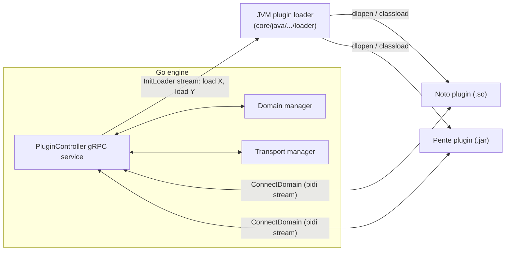

# Chapter 5 — Plugin Architecture

Paladin's extensibility — and its portability — rests on one design choice: **every extension
point is a gRPC protocol, not a code-level API**. Domains, transports, registries, signing
modules, and RPC-auth providers are all *plugins* that exchange protobuf messages with the engine
over a local gRPC socket.

## 5.1 The plugin controller

The single gRPC service is **`PluginController`**
(`toolkit/proto/protos/service.proto:279`), served by the engine:

- `InitLoader(PluginLoaderInit) returns (stream PluginLoad)` — the JVM-hosted plugin loader
  connects once and receives a stream of load instructions. `PluginLoad.LibType` is `C_SHARED`
  (Go plugins compiled as C shared libraries, loaded via JNA) or `JAR` (Java plugins loaded by
  class name).
- `ConnectDomain`, `ConnectTransport`, `ConnectRegistry`, `ConnectSigningModule`,
  `ConnectRPCAuthPlugin` — each a **bidirectional stream** of typed message envelopes. A loaded
  plugin dials back and holds this stream open for its lifetime.

Each envelope (e.g. `DomainMessage`, service.proto:50) carries a correlation `Header` and a
`oneof` of request/response bodies in both directions — so both the engine and the plugin can
initiate calls, multiplexed on one stream.

## 5.2 The domain contract

The domain protocol lives in `toolkit/proto/protos/to_domain.proto` (engine → domain) and
`from_domain.proto` (domain → engine callbacks). A domain implements:

| RPC | Purpose |
|---|---|
| `ConfigureDomain` / `InitDomain` | Receive config (incl. `chain_id`, registry contract address); return state schemas (ABI JSON) and event definitions |
| `InitDeploy` / `PrepareDeploy` | Two-phase deployment of a new domain contract instance (resolve verifiers, then produce the factory call) |
| `InitContract` | Load per-instance config when a `PaladinRegisterSmartContract_V0` event is indexed |
| `InitTransaction` / `AssembleTransaction` | Resolve required verifiers; assemble states + attestation plan |
| `EndorseTransaction` | Re-validate a transaction on an endorser node; return signature |
| `PrepareTransaction` | Produce the base-ledger transaction (or a chained private one) |
| `HandleEventBatch` | Process indexed chain events; report completed transactions & state finalizations |
| `InitCall` / `ExecCall` | Read-only domain queries (e.g. Noto `balanceOf`) |
| `Sign` / `GetVerifier` | Domain-specific crypto (Zeto's prover) |
| `BuildReceipt` | Produce the domain receipt (chapter 6/7 use these heavily) |
| `ConfigurePrivacyGroup` / `InitPrivacyGroup` / `WrapPrivacyGroupEVMTX` | Privacy-group domains (Pente) |
| `ValidateStateHashes`, `CheckStateCompletion`, `IsBaseLedgerRevertRetryable`, `InvokeRPC` | Validation & utility hooks |

Callbacks available to domains (`from_domain.proto`): `FindAvailableStates`, `GetStatesByID`,
`EncodeData`/`DecodeData` (engine-side ABI/EIP-712/EVM-transaction encoding — `EncodingType`
enum), `RecoverSigner`, `SendTransaction` (submit follow-on transactions), `LocalNodeName`,
`ReverseKeyLookup`.

> **Where the EVM leaks in.** `PrepareTransactionResponse` carries
> `PreparedTransaction{function_abi_json, params_json, contract_address}` (to_domain.proto:462) —
> a prepared transaction *is* an EVM ABI call. Deploys carry `bytecode` + constructor ABI.
> Events arrive as EVM logs (`on_chain_events.proto`: keccak `signature`, `block_number`,
> `log_index`). `EncodingType` enumerates EVM encodings (`FUNCTION_CALL_DATA`,
> `ETH_TRANSACTION`, `TYPED_DATA_V4`…). These messages are the highest-leverage abstraction
> point for Part 2 (chapter 11): evolve them, and every domain — in any language — becomes
> potentially chain-portable.

## 5.3 Plugin-author SDKs

- **Go**: `toolkit/go/pkg/plugintk` — `DomainAPI` (plugin_type_domain.go:27) mirrors the RPCs
  1:1; `DomainCallbacks` wraps the reverse direction; `NewDomain` wires the bidi stream. A Go
  domain is: implement the interface, export `Run`/`Stop` via cgo, compile with
  `-buildmode=c-shared`. Parallel types exist for transports, registries, signing modules.
- **Java**: `toolkit/java/.../toolkit` — the same contract for JVM plugins (Pente uses it).

## 5.4 Transports, registries, signing modules

Same envelope pattern, smaller vocabularies:

- **Transport plugins** (`to_transport.proto`): `ActivatePeer`/`DeactivatePeer`, `SendMessage`;
  inbound messages are handed to the engine with a `Component` routing hint, and the transport
  manager routes to the right consumer (`TransportClient.HandlePaladinMsg`,
  `components/transportmgr.go:58`). The reference implementation is mTLS gRPC (chapter 8).
- **Registry plugins** (`to_registry.proto`/`from_registry.proto`): push
  `UpsertRegistryRecords` (identity → properties, including transport endpoints); may source
  records from config (static) or chain events (`RegistryEventSource`).
- **Signing-module plugins** (`to_signing_module.proto`): `ResolveKey`, `SignWithKey`,
  `ListKeys` — remote/HSM-backed key operations behind the same algorithm-agnostic strings the
  key manager uses.

## 5.5 Why this matters for the port

Three consequences worth stating explicitly:

1. **Language neutrality is proven** — Go and Java plugins already coexist. A Rust plugin
   (Part 2's Sente; Part 3's everything) is a new binding to an existing, stable protocol, not a
   new architecture.
2. **The protocol is engine-implementation-agnostic** — nothing in the protos says "the engine is
   Go". Part 3's Rust engine could serve the same `PluginController` and load today's compiled
   Noto/Zeto plugins unchanged.
3. **The protocol is *mostly* chain-agnostic** — the exceptions are precisely the EVM-shaped
   messages listed in 5.2, which is why chapter 11 evolves those messages first and leaves the
   rest of the protocol alone.

---

*Next: [Chapter 6 — The privacy domains](06-domains-noto-zeto-pente.md)*
