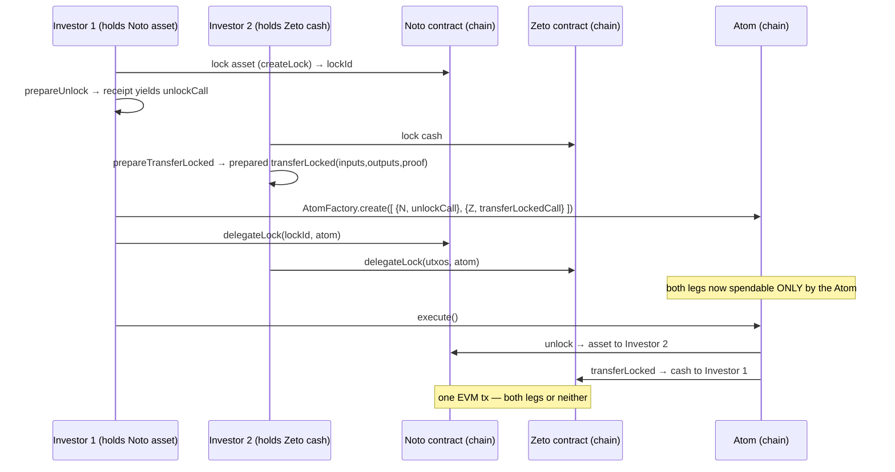

# Chapter 7 — Atomic Interoperability

Paladin's most distinctive capability: transactions in *different privacy domains* — different
trust models, different cryptography — settling **atomically**: both happen or neither does.
Docs: `doc-site/docs/architecture/atomic_interop.md`,
`doc-site/docs/concepts/atomic_programmability.md`.

## 7.1 The Atom contract

`solidity/contracts/shared/Atom.sol` (+ `AtomFactory.sol`, which clones instances cheaply and
emits `AtomDeployed`):

```solidity
struct Operation { address contractAddress; bytes callData; }
// created with an immutable ordered list of operations
function execute() external nonReentrant { /* Pending → Executed, once */
    for (uint i = 0; i < operations.length; i++)
        operations[i].contractAddress.functionCall(operations[i].callData);
}
```

`execute()` performs every operation in order inside **one EVM transaction**; if any leg reverts,
the whole transaction reverts. Atomicity is inherited entirely from EVM transaction semantics —
which is also its limit: *all legs must live on the same chain* (the assumption Part 2's interop
chapter must break).

## 7.2 The three primitives that make it safe

An Atom is a dumb executor. The safety comes from what the domains hand it:

1. **Prepared transactions.** Instead of submitting, a party asks Paladin to *prepare*: the full
   assemble→endorse pipeline runs, and the output is the exact, endorsed base-ledger calldata
   (e.g. Noto's `unlockCall` from the domain receipt; Zeto's
   `transferLocked(inputs, outputs, proof, data)` with the ZK proof already inside). Nothing can
   be altered without invalidating signatures/proofs.
2. **Locks.** Each party locks the states it is spending (`createLock` in Noto, `lock` in Zeto),
   fixing spend/cancel commitments — so the states cannot be spent by anything except the
   pre-agreed operations, and cannot be double-spent while the deal is pending.
3. **Delegation.** `delegateLock(lockId, atomAddress)` — the Atom's address becomes the only
   entity able to trigger the unlock. The notary/prover has already authorized *exactly one*
   outcome; the delegate merely decides *whether* it happens.

## 7.3 Worked example: Zeto cash ⇄ Noto asset DvP

From `examples/swap/src/index.ts` (TypeScript SDK):



At no point does either party trust the other: before `execute()`, each can cancel via its
domain's cancel path; after `execute()`, both legs have settled. The `examples/bond/` flow
composes further — Noto cash ⇄ Noto bond with Pente private subscription logic
(`solidity/contracts/private/BondSubscription.sol`) driving the same Atom pattern via
`PenteExternalCall`.

## 7.4 The single-ledger assumption, stated precisely

Everything above rests on facts that hold **only within one chain**:

- `Atom.execute()` calls contract addresses resolvable on *its* chain, in *its* transaction
  context.
- Revert-based rollback is a property of one EVM execution.
- `delegateLock` grants spend authority to an address *on the same chain*.

There is **no bridge, no HTLC, no light client, no cross-chain messaging anywhere in this
repository** — the docs are explicit that interop means "a single shared EVM ledger". Meanwhile,
the *privacy plane* (transport, registry, identity, state distribution) has no chain awareness at
all and would happily span nodes anchored to different chains.

That asymmetry defines the cross-ledger problem Part 2 chapter 15 solves: keep the shared privacy
plane, and replace single-transaction atomicity with protocols (notary-coordinated settlement,
hash-time-locked swaps) that approximate it across two chains.

---

*Next: [Chapter 8 — Supporting infrastructure](08-supporting-infrastructure.md)*
