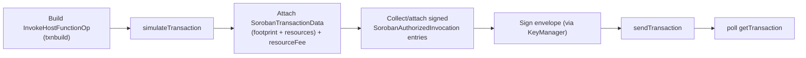

# Chapter 12 — The Stellar Backend

The Stellar implementation of the BLI: a client, a signer extension, an ingestor, and a
submitter. Everything here lives in `core/go/pkg/stellarclient`,
`core/go/pkg/baseledger/stellar`, and `core/go/internal/publictxmgr` (Stellar submitter), built
on `github.com/stellar/go-stellar-sdk` v0.6.0 (the renamed successor to the deprecated
`github.com/stellar/go` — already migrated, no further tracking needed).

> ## How it works today
>
> Chapter 12's backend is complete and carries real, confirmed on-chain traffic on public Stellar
> Testnet (ch. 14). §12.1's `stellarclient` is a thin constructor over
> the SDK's own `*rpcclient.Client`, no Horizon dependency anywhere; `baseledger/stellar.Client`
> implements all six `baseledger.Client` methods; the ed25519 signing extension
> (`algorithms.EDDSA_ED25519`/`verifiers.STELLAR_ADDRESS`/`signpayloads.OPAQUE_TO_EDDSA`) is wired
> with SLIP-10 HD derivation, verified against the official test vectors. §12.2's submitter covers
> sequence assignment, channel-account pooling and bootstrap, transaction build/sign/submit,
> restore-preamble handling, classic-op submission, and `xdr.TransactionResultCode`-based error
> classification. §12.3's classic-operations codec (`XDR_CLASSIC_OPS`) and trustline pre-flight
> helper (`CheckTrustline`) are implemented. §12.4's ingestion path is in place:
> `baseledger/stellar.Ingestor` polls `getLedgers`, and `core/go/internal/ledgerindexer/stellar`
> persists final ledgers into the same indexed tables the EVM path uses; `componentmgr` boots this
> indexer for `baseLedger.type: stellar`, and `publictxmgr` switches submitter construction on
> `ChainInfo().Kind`. The consumer-facing event-stream side (§12.4) is also in place: a narrow
> `blockindexer.EventStreamManager` interface lets `domainmgr`/`registrymgr`/`txmgr` register
> subscriptions against Stellar-ingested events the same way they do for EVM, reusing the
> `event_streams`/`event_stream_checkpoints` tables plus a Stellar-only companion table preserving
> event `Emitter`/`Topics`/`Data` for live dispatch and catchup. §12.6's `ttlJanitor` (batched
> `extend_ttl` on a configurable watch-list) and local-dev quickstart (`stellar/quickstart` in
> `testinfra/docker-compose-test.yml`, a 3-node Stellar config, a matching Gradle task) are both
> implemented and in daily use. §12.5's `registries/stellar` plugin (reading the identity-registry
> contract's events, mirroring `registries/evm`) is built — see chapter 13.
>
> The bar cleared so far is real: `TestStellarComponentTest`'s full
> deploy/mint/transfer/lock/prepareUnlock/delegateLock sequence plus a state-resync drill, and
> Sente's 3-node group genesis/transition, have both been run and confirmed against real public
> Stellar Testnet (ch. 14).
>
> ## What's left for production use / full EVM parity
>
> - **Fee-bump transactions and the auth-entry-expiry re-endorsement path** (§12.2) are not yet
>   implemented — a submission that goes stale past `resubmitLedgers` has no RBF-equivalent yet, and
>   an auth entry that expires before use has no sequencer-side re-endorsement path.
> - **Retention-gap fail-loud behavior and real backfill handling** are not built — a checkpoint
>   that falls behind stellar-rpc's 24h-7d retention window has no defined recovery path yet
>   (§12.4).
> - **`SnapshotContractState`** (the `getLedgerEntries`-based state-resync escape hatch, §12.4) is
>   not implemented.
> - **The operator (`operator/`) CR additions** in §12.6 — a `Stellar`-flavored node CR or generic
>   `baseLedger` CR section, and Stellar equivalents of `SmartContractDeployment` — don't exist. The
>   quickstart/3-node setup runs through plain docker-compose + config YAML, not the Kubernetes
>   operator; a production, operator-managed Stellar node deployment needs this.
> - **No CI/nightly job** runs any of this against real public Testnet — every Testnet confirmation
>   to date has been a manual, one-off run (ch. 14).
> - **Throughput/chaos acceptance criteria are unverified**: parallel-submission throughput with a
>   channel-account pool (§12.7 criterion 6), a forced-archival restore-preamble drill (criterion
>   3), and a fee-bump-on-stale drill (criterion 4) have no automated test yet.

## 12.1 `stellarclient`

Mirrors `ethclient`'s role as a thin constructor over Stellar RPC. RPC methods used: `simulateTransaction`, `sendTransaction`,
`getTransaction(s)`, `getLedgers`, `getEvents`, `getLedgerEntries`, `getLatestLedger`,
`getFeeStats`, `getNetwork`, `getHealth`.

**The canonical invocation pipeline** (vs. EVM's estimate→sign→send) — `simulateTransaction`
here is powered by the same `soroban-simulation` recording-mode library Sente later embeds
in-process for private execution (ch. 14 §14.3):

**Signing goes through the KeyManager — never locally.** New constants (additive, following the
existing open-string pattern):

- `toolkit/go/pkg/algorithms`: `EDDSA_ED25519 = "eddsa:ed25519"`.
- `toolkit/go/pkg/verifiers`: `STELLAR_ADDRESS = "stellar_address"` (StrKey `G…` from the
  ed25519 public key).
- `toolkit/go/pkg/signpayloads`: `OPAQUE_TO_EDDSA` — the signer receives the 32-byte
  `SHA-256(TransactionSignaturePayload XDR)` (which embeds the network-passphrase hash, per
  Stellar convention) and returns a raw ed25519 signature.
- HD derivation: the SLIP-0010 ed25519 branch added to the existing HD wallet in
  `toolkit/go/pkg/signer`. The signing-module *plugin* protocol needs **no changes** — that API
  was designed algorithm-agnostic.

**Auth entries — the notary analogue.** Simulation reports which addresses must authorize which
invocations. Where the authorizer is the transaction source, source-account credentials suffice.
For third parties — the Saladin analogue of "the notary's signature travels inside the calldata
while an anonymous key submits" — the domain supplies **pre-signed auth entries**
(`SorobanInvoke.auth_entries_xdr`, ch. 11), signed during endorsement via
`EncodingType.SOROBAN_AUTH_ENTRY` + `keymgr` sign.

> ⚠️ **New failure mode with no EVM analogue:** auth entries carry a
> `signature_expiration_ledger`. The sequencer must set it generously (e.g. now + 1000 ledgers ≈
> 100 min), and the submitter must detect expiry and bounce the transaction back to the
> sequencer for **re-endorsement** — a new sequencer error path that must be implemented and
> tested (risk R15, ch. 16).

## 12.2 The Stellar `ChainSubmitter`

`core/go/internal/publictxmgr/stellar_chain_submitter.go`, implementing ch. 11's interface.

**Sequence numbers are not nonces.** Differences that invalidate the EVM logic:

- A sequence number is consumed by every transaction an account *sources* — including failed
  ones that made it into a ledger.
- There are no gaps to fill: a transaction with a wrong sequence is rejected at submission, not
  queued. The EVM "fill the nonce gap" recovery machinery is dead code here.
- Throughput per source account ≈ one transaction per ledger (~5 s) unless carefully pipelined.

**Design: channel-account pool.** For each signing identity used for submission, the submitter
manages N derived **channel accounts** (`m/…/<identity>/channel/<i>`) that act as transaction
*source* (sequence + fees), while the business authorization rides in the auth entries. This is
idiomatic Stellar, restores EVM-like parallelism, and doubles as the **anonymous submission**
mechanism: channel accounts are funded operationally and reveal nothing about the notary or
parties. Pool size is config (`stellar.channelAccounts`, default 8); accounts are created/funded
by an ops task at node bootstrap.

**Fees.** No gas auction: resource fee comes from simulation; the inclusion fee from
`getFeeStats` at a configured percentile (`stellar.feeInclusionPercentile`, default p70).
**Stale handling** (`ActionOnStale`): if not included within `resubmitLedgers` (default 5),
wrap in a **fee-bump transaction** (the RBF equivalent); on `entryArchived` /
footprint-invalidation errors, **re-simulate and rebuild** (bounded retries, then error to
sequencer).

**Restore preamble.** If simulation returns a `restorePreamble` (a needed entry is archived),
the submitter first submits a separate `RestoreFootprintOp` transaction from the same channel
account, waits for inclusion (new orchestrator stage `StageRestore`; persisted
`restore_tx_hash`), then submits the real transaction.

**Confirmation matching** works unchanged: TxID is a 32-byte hash on both chains, matched from
ingested ledgers.

## 12.3 Classic operations, accounts & trustlines

Native-asset support (ch. 13 §13.6) needs a handful of **classic operations** — `ChangeTrust`,
`SetTrustLineFlags`, occasionally `Payment`/`CreateAccount` — which are *not* Soroban
invocations (and are exempt from the one-op rule: a classic transaction may carry up to 100
operations).

- **BLI addition (deliberately narrow):** one new payload kind,
  `PayloadEncoding.XDR_CLASSIC_OPS` — an XDR-encoded list of classic operations for
  `UnsignedChainTx`. It rides the same submitter path (sequence assignment, fees, fee-bump on
  stale) but **skips simulation/footprint entirely** (classic ops have neither). ⚠️
  Scope-creep warning (risk R20, ch. 16): this is for account/trustline plumbing, not a gateway to
  classic-Stellar features — payments channels, offers/DEX, claimable balances stay out of the
  BLI.
- **Account & trustline utilities** (node-level, exposed as admin RPC/ops tooling):
  - `ChangeTrust` for a local identity (signed by that identity's key — a trustline can only be
    created by its holder), used before an unshield to a fresh account;
  - issuer-side helpers for regulated assets: `SetTrustLineFlags` (approve/freeze a `G…`
    holder) and SAC `set_authorized` (authorize the domain pool or a contract holder);
  - channel-account bootstrap (already in §12.2) shares this machinery.
- **Trustline pre-flight:** `stellarclient.CheckTrustline(account, asset) → {exists,
  authorized, limitHeadroom}` via `getLedgerEntries` — called by domains at assembly so an
  unshield to a missing/frozen/full trustline fails fast with an actionable error instead of an
  on-chain failure burning fees. (XLM: trivially true.)

## 12.4 The Stellar ingestor

- **Source of truth: `getLedgers` polling** (~2 s interval; ledgers close ~5 s) — *not*
  `getEvents` alone, because the publictxmgr needs transaction results, not only events. Each
  ledger's `LedgerCloseMeta` XDR yields all transactions (hash, source, result) and all contract
  events → one `LedgerUnit` (ch. 11).
- **No re-orgs.** SCP finality ⇒ the ingestor emits final-only and the neutral indexer's
  confirmation-depth logic is bypassed (`confirmations = 0` always). Receipt latency ≈ one
  ledger (~5 s).
- **Retention is the operational constraint.** stellar-rpc keeps 24 h (default) to 7 d (max).
  Responses: (1) checkpoint per ledger (already the indexer model); (2) on startup, if
  `checkpoint < oldestLedger(rpc)` → **fail loudly** unless a backfill source is configured
  (future historical ingestion should be RPC/indexer/archive based, not Horizon-backed - this
  repo does not depend on Horizon anywhere); (3) ops guidance: self-host stellar-rpc with 7-day
  retention; treat a gap beyond retention as disaster recovery.
- **State-resync escape hatch.** Because the SNoto/SZeto contracts keep their authoritative sets
  as enumerable ledger entries (ch. 13), `stellarclient.SnapshotContractState(contractID,
  keyPrefix)` (via `getLedgerEntries`) can rebuild a domain's on-chain view directly — a
  recovery tool the EVM design never needed. Worth building early; it converts several risk
  scenarios from "data loss" to "slow resync".
- **Event selectors.** Soroban events carry `Vec<SCVal>` topics, conventionally
  `topic[0] = Symbol("transfer")`. The ingestor computes
  `Selector = SHA-256("saladin:" + contract_spec_name + ":" + topic0_symbol + ":v0")` so that
  event-stream matching remains a bytes32 SQL comparison, exactly like keccak topics today.
  `friendly_signature` renders as e.g. `snoto.transfer#v0`.
- **Implemented:** the consumer-facing half of this — letting `domainmgr`/`registrymgr`/`txmgr`
  actually register a subscription against Stellar-ingested events — via a new
  `blockindexer.EventStreamManager` interface (the narrow subset of `BlockIndexer` those three
  managers use) and a Stellar-side implementation reusing the existing chain-neutral
  `event_streams` tables, plus a Stellar-only companion table preserving event
  `Emitter`/`Topics`/`Data` for catchup. This is what makes it possible for a domain plugin to
  learn about confirmed/spent state on Stellar at all; no domain plugin exercises it yet (ch.
  13/14 are separate, unbuilt work).

## 12.5 Contract discovery and registries

- **`SaladinFactory` contract** (ch. 13) is the `PaladinRegisterSmartContract_V0` equivalent:
  `register(tx_id, instance, config)` emits event topics `("reg", tx_id)` with
  `(instance, config)` data, which the domain manager's event stream consumes to learn new
  instances. Because Soroban contracts can deploy contracts, domain factories **deploy and
  register in one atomic invocation** (an improvement over the EVM two-step). Not built yet —
  ch. 13/14 territory.
- **Registries: `registries/stellar` built (chapter 13), reversing this section's original call.**
  The chain-agnostic static registry plugin remains available and sufficient for simple setups,
  but a `registries/stellar` plugin mirroring `registries/evm` was in fact built in chapter 13
  Phase 4 — scoped to reading the identity-registry contract's events only (not
  `SaladinFactory`/instance-discovery, which stays `domainmgr`'s job on both chains, matching
  `registries/evm`'s own precedent). See chapter 13 for the plugin, the event-selector fix it
  needed (`ComputeEventSelectorWithSpec`, to disambiguate event names across multiple Soroban
  contract specs), and the still-open gap around populating the `$specName` property for future
  domain-instance contracts beyond this one.

## 12.6 Node operations additions

- **Implemented: `ttlJanitor`** background task — watches a configurable set of ledger entries,
  checks TTL (`getLedgerEntries` → `liveUntilLedgerSeq`), and submits batched `extend_ttl`
  keepalives below a configured threshold (ch. 13 explains why archival is liveness-only, but the
  janitor keeps latency flat). Since no domain contract exists yet, it currently has no
  auto-discovered watch-list — a domain would register its own keys with it once one exists; the
  watch/unwatch mechanism itself is generic and ready.
- **Implemented: local dev quickstart.** A `stellar/quickstart` service (RPC + core, accelerated
  ledgers, no Horizon) sits in `testinfra/docker-compose-test.yml` beside Besu, with a 3-node
  Stellar config (`core/go/noderuntests/componenttest/config/stellar.node{1,2,3}.config.yaml`,
  distinct signing identities per node, a shared funder wallet for channel-account bootstrap) and
  a `componentTestStellarSQLite` Gradle task bringing the compose network and 3 nodes up together.
  This gives a working docker-compose 3-node Stellar network to demo against — it has nothing
  domain-specific deployed on it yet, since no SNoto/SZeto/Sente contract exists (ch. 13/14).
- **Not built: operator (`operator/`) additions** — a `Stellar`-flavored node CR (or a generic
  `baseLedger` section in the Paladin CR) and Stellar equivalents of `SmartContractDeployment`
  (Wasm upload + instantiate). Deliberately out of scope for the docker-compose demo above, which
  runs through plain compose + config YAML instead, mirroring how the existing EVM component tests
  don't go through the operator either. Revisit only if a Kubernetes-hosted demo is needed.

## 12.7 Acceptance criteria

1. ◐ **Partial.** On a local quickstart network: `ptx_sendTransaction` (public, Soroban invoke) →
   receipt with correct TxID — **met**, proven repeatedly by the live SNoto/Sente demos (ch. 14).
   Visible via `bidx_`-equivalent ledger queries — **not met**: that RPC surface is registered for
   `type: evm` nodes only (ch. 11's "what's left"), so no equivalent query path exists for Stellar
   yet even though the indexer already writes chain-neutral rows.
2. ✅ **Met.** Third-party pre-signed auth entry flow: transaction sourced by channel account A
   executes an op authorized by identity B's auth entry; on-chain source ≠ B anywhere — this is
   exactly SNoto's notary-authorized transfer/mint path, proven live on quickstart and real
   Testnet (ch. 14 §14.1).
3. ❌ **Not met.** Forced-archival chaos test: expire a target entry (quickstart TTL manipulation),
   submit a touching transaction → automatic restore preamble → success; `restore_tx_hash`
   populated. The restore-preamble mechanism itself is implemented (§12.2), but this specific
   chaos drill has never been run.
4. ❌ **Not met.** Fee-bump path: artificially underprice inclusion fee → stale detection →
   fee-bump → inclusion. Fee-bump submission isn't implemented yet (§12.2's "what's left").
5. ❌ **Not met.** Retention-gap drill: stop the indexer > retention, restart → loud failure
   without backfill config; successful catch-up once an RPC/indexer/archive-based backfill source
   is configured. Retention-gap fail-loud/backfill behavior isn't built yet (§12.4's "what's left").
6. ❌ **Not met, mechanism partially there.** Throughput: ≥ N parallel in-flight submissions with a
   channel-account pool of N, no `txBAD_SEQ` storms. The channel-account pool itself is real and in
   daily use (real Testnet demos configure and exercise it), but no formal throughput measurement
   against this criterion's exact bar has been run.
7. ❌ **Not met.** Sequencer re-endorsement path on auth-entry expiry exercised by an integration
   test. This path has no implementation yet (§12.1's own callout, corrected this pass — it is not
   a "tested path" as risk R7 previously, incorrectly, implied).
8. ◐ **Partial.** Classic-op path: a `ChangeTrust` submitted via `XDR_CLASSIC_OPS` (no simulation)
   confirms through the same submitter/indexer machinery — the codec and submission path exist
   (§12.3), but "fee-bump on stale works for classic txs too" can't be met until fee-bump itself
   exists (criterion 4).
9. ◐ **Partial.** Trustline pre-flight: `CheckTrustline` correctly distinguishes missing /
   unauthorized / limit-exhausted trustlines against a quickstart network with an `AUTH_REQUIRED`
   test asset. The Go-side `CheckTrustline` helper is implemented (§12.3), and the equivalent
   rejection scenarios are unit-tested at the contract level (ch. 13 §13.7, criteria 7–9) — but
   unlike mint/transfer/lock, shield/unshield wasn't part of the live 3-node Testnet demo, so this
   exact integration path is unproven outside unit tests.

---

*Next: [Chapter 13 — Soroban contracts](13-soroban-contracts.md)*
