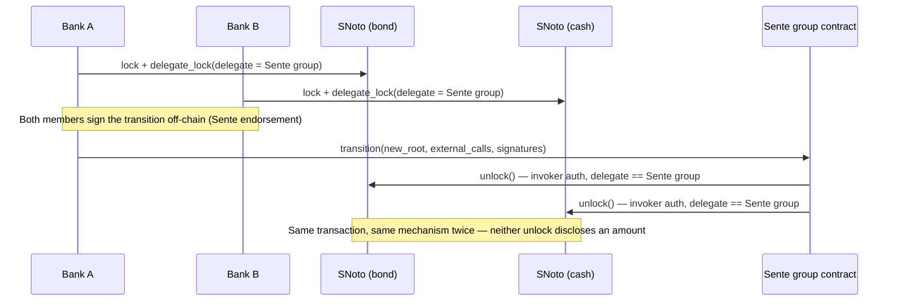

# Chapter 18 — Institutional Demo: Interbank Repo

A business case for Saladin, built on top of the port (chapters 10–15), aimed at a specific
institutional audience rather than at Paladin engineers. This chapter is a design, not yet a
build — §18.7 sizes what it would take.

## 18.1 The business case

**Repo (repurchase agreement)** is one of the largest, most systemically important short-term
funding markets in the world: banks routinely borrow cash overnight or short-term against
high-quality collateral (government bonds, agency securities), with tri-party and bilateral repo
volume regularly exceeding several trillion dollars a day in the US alone. It is also a market
with a well-known, named settlement problem: **when collateral and cash don't settle atomically,
a counterparty default mid-settlement creates real principal risk** — the reason
delivery-versus-payment (DvP) exists as a settlement principle at all.

This isn't a hypothetical concern institutions are only now discovering on-chain:

- **JPMorgan's Onyx/Kinexys platform** has processed over $1.5 trillion notional in atomic
  intraday repo since 2020, settling tokenized collateral against tokenized cash (JPM Coin) in one
  step specifically to remove this risk.
- **Broadridge's Distributed Ledger Repo (DLR) platform** runs real bilateral repo for major banks
  (Société Générale, CIBC, HSBC, UBS among its participants) on a permissioned DLT explicitly to
  get atomic DvP that today's settlement rails don't provide.
- **The ECB's 2024 wholesale DLT settlement trials** (Banque de France's DL3S, Bundesbank's
  Trigger Solution) tested exactly this shape: repo against tokenized central-bank-money-adjacent
  cash.

**Why privacy is the actual value proposition here, not an incidental feature**: banks do not want
their bilateral repo rate, notional, or counterparty exposure visible to competitors on a shared
ledger. This is one of the most commonly cited objections to DLT settlement adoption in exactly
this market. A design that settles atomically but discloses the trade's economics to every node on
the network solves the counterparty-risk problem while creating a new one.

**Target institutions**: repo/treasury desks at banks of the kind already piloting this shape
(Broadridge DLR's and JPMorgan Onyx's own participant lists); custodian and tri-party agents as
the natural registrar/notary for a digital bond (BNY Mellon, Euroclear, Clearstream already play
this exact role in today's market); stablecoin issuers — Circle's USDC, used here, is issued
natively on Stellar today, not a hypothetical asset.

## 18.2 What this demo shows

Three distinct primitives, interacting atomically in one Soroban transaction:

1. **SNoto** — a real, independently-transferable digital bond, not a private bilateral IOU.
   Ownership is tracked by SNoto's confidential-UTXO model and attested by a registrar/notary,
   exactly the role a CSD or transfer agent already plays for real bonds today.
2. **Sente** — the private bilateral repo agreement between exactly two counterparties. Its
   `transition` mechanism (ch. 14 §14.3) is what makes atomic settlement possible: it can fire
   multiple `external_calls` in one transaction, so the collateral leg and the cash leg both
   commit or both fail together.
3. **A classical Stellar asset** — USDC, entering and leaving via its own Soroban Asset Contract
   (SAC) interface (ch. 13 §13.6) at shield/unshield time, then moving privately as a second SNoto
   instance's coin for the actual repo settlement. The cash leg is backed 1:1 by the real asset,
   not a claim on nothing — it just doesn't ride as a bare SAC transfer during settlement itself.

A repo's collateral needs to be a fungible, independently verifiable instrument other
counterparties can also hold and trade — exactly what an SNoto instance, attested by a
registrar/notary, already is. Modeling the bond as private state *inside* the Sente group instead
would make it invisible and untransferable to anyone outside this one bilateral trade, which is
not how collateral actually works. The cash leg needs the same property for a different reason:
a raw SAC transfer during settlement would disclose the exact notional (and, across both legs of
the trade, the implied repo rate) to anyone watching the ledger — §18.3 works through exactly what
that discloses and why a second SNoto instance, not a bare SAC transfer, is this chapter's design.

## 18.3 Privacy and disclosure characteristics

For institutional participants, "private" and "public" need to be exact, not asserted. Here is
what each instrument actually discloses on-chain, to whom, and what stays confidential — instrument
by instrument, not as a blanket claim about the design.

### The bond (SNoto)

**Public** (visible to anyone watching the Stellar ledger):
- The SNoto contract instance's address, and that it exists.
- That a `mint`/`transfer`/`lock`/`delegate_lock`/`prepare_unlock`/`unlock` call happened, at a
  given ledger and timestamp.
- The opaque 32-byte **state IDs** referenced as inputs/outputs of each call — a hash, not a
  value. It shows *that* some state changed, never what that state represents.
- Which delegate address a lock is assigned to — e.g. "this lock's delegate is now contract
  address `C...`" (in this demo, the Sente group's own contract address) is a genuine, disclosed
  on-chain fact.
- The registrar/notary's own identity (their signing key/verifier) — like a real CSD or transfer
  agent, this role isn't meant to be anonymous.

**Private** (known only to the bond's current owner, the notary, and whichever parties Paladin's
own state-distribution mechanism gives access to — never the wider network):
- **Who** owns the bond at any point — encoded only in the off-chain Paladin state record behind
  that state ID, never on-chain.
- **How much** face value / notional the holder holds.
- Any business-schema fields the coin type carries (a CUSIP/ISIN, series identifier, etc.) beyond
  what an on-chain event happens to echo.

### The repo agreement itself (Sente)

**Public:**
- The `SentePrivacyGroup` contract's address, and that it exists.
- That a `genesis`/`transition` event fired, at a given ledger and timestamp.
- The group's **root hash** after each transition — one 32-byte commitment, revealing nothing
  about the state it commits to.
- The group's **member public keys**, registered on-chain at genesis for signature verification —
  "these N ed25519 keys form a group together" is discoverable on-chain, even before those keys
  are linked to "Bank A"/"Bank B" identities anywhere. (Whether they *can* be linked depends on the
  registry's own visibility scope — a Paladin-level consideration, not a Sente-specific one.)

**Private:**
- The repo's own economic terms — **notional, rate, tenor, haircut**, and any bespoke covenant
  (substitution rights, default terms) — none of this is represented on-chain at all today; Sente's
  `transition` is a generic root advance plus external calls, with no notion of "this is a repo
  maturing on date X at rate Y" (§18.6 flags this as not-yet-designed). Because the cash leg
  settles as a shielded SNoto transfer rather than a raw SAC transfer (below), none of these terms
  is derivable from the settlement transactions either — unlike a design where cash moves as a bare
  classic-asset payment, where the notional and implied rate would be arithmetic from two public
  numbers regardless of whether "rate" is ever an explicit field.
- Which specific business logic a `transition` executed, beyond the bare fact that one happened and
  the root advanced.

### The cash leg (USDC, shielded into a second SNoto instance)

USDC participates via SNoto's already-built shield/unshield gateway (ch. 13 §13.6), not as a bare
SAC transfer riding inside the settlement transaction. Concretely, this is a **second SNoto
instance** ("SNoto-cash"), deployed the same way as the bond instance but configured with
`sac = <USDC's SAC address>` — SNoto's `Sac` field is a single `Address` in instance storage
(ch. 13 §13.2), so one instance backs exactly one asset, and the bond and cash genuinely need
separate instances. §18.5 has the full mechanics; here is what that means for disclosure.

**Public — the two points where real USDC actually moves:**
- `deposit` (shield): a real `sac.transfer(bank → pool)`, with the depositor's address and the
  **exact amount** disclosed in cleartext — the same disclosure profile as a Zeto deposit on EVM
  (ch. 13 §13.6). This happens whenever a bank funds its cash pool, not necessarily tied 1:1 to any
  one trade's timing.
- `withdraw` (unshield): the same disclosure, in reverse, whenever a bank converts shielded cash
  back to spendable USDC — on its own schedule, not necessarily at trade settlement.

**Private — the repo settlement itself:**
- Both the near-leg and far-leg `transition`s move the cash leg as `snoto_cash.unlock(...)`, the
  identical mechanism the bond leg uses. Neither `unlock` event discloses an amount or an owner —
  only opaque state IDs, exactly like the bond. **The settlement transactions themselves reveal
  nothing about notional or rate.**

**What this buys, precisely**: an observer watching only the settlement transactions cannot derive
the repo's notional or its implied rate, because there are no longer two public cash numbers to
subtract — unlike a design where cash moves as a raw SAC transfer during settlement, which would
disclose the exact amount on both legs and let anyone compute `(far − near) / near` as the implied
rate. What an observer *can* still do is correlate a bank's `deposit`/`withdraw` history with the
timing of Sente `transition`s against the same group address — a weaker, statistical link, not an
exact one, and one that gets weaker the more a bank's shielded cash pool is used across many trades
rather than funded and drained per-trade.

**Who sees the amount anyway**: the cash instance's notary. Every SNoto transfer/lock/unlock — cash
included — is notary-authorized, so this one institution knows every amount that moves through the
pool, even though the network never does. This could plausibly be the *same* institution as the
bond's registrar (real tri-party agents already run both legs of a repo as one service), or a
distinct cash-settlement bank. This is a real, disclosed trust assumption, not a gap: it mirrors
exactly how a tri-party or custodian agent already sees cash movements in today's repo market.

**A stronger alternative exists, but isn't built yet**: SZeto's Groth16-proof-based transfers would
hide the amount from every party, including the notary — no institution would see the notional at
all. This chapter doesn't use it because SZeto's Go-side domain port hasn't started (ch. 14 §14.2)
and its native-asset gateway is unit-tested only, never reaching a real SAC transfer in tests
(ch. 13 §13.3) — real, currently-unbuilt work, not a drop-in swap. It would also integrate
differently: SZeto's `transfer` is authorized by presenting a valid proof, not by
`require_auth`/a delegate, so the invoker-authorization pattern this chapter's cash leg reuses from
the bond leg wouldn't carry over unchanged.

## 18.4 Actors and roles

| Role | Real-world analogue | On-chain role |
|---|---|---|
| Bond registrar | CSD / transfer agent (BNY Mellon, Euroclear, Clearstream) | SNoto-bond notary — mints and attests bond ownership |
| Cash notary | Cash correspondent / tri-party agent (plausibly the same institution as the bond registrar) | SNoto-cash notary — authorizes every shielded cash transfer, sees every amount |
| Bank A | Collateral provider / cash borrower | SNoto-bond holder; Sente group member 1 |
| Bank B | Cash provider / collateral taker | SNoto-cash holder (post-shield); Sente group member 2 |
| Circle | USDC issuer | Issues the classic Stellar asset neither bank nor Saladin controls |
| Sente group `{Bank A, Bank B}` | The bilateral repo agreement itself | Coordinates both legs by holding delegated locks on both SNoto instances; holds no funds itself |

## 18.5 Technical architecture

### Setup (once, before any repo trade)

- The bond registrar deploys an SNoto instance for the bond (`SNotoFactory.deploy`, ch. 13 §13.5),
  mints the bond's UTXO to Bank A.
- The cash notary deploys a second SNoto instance for cash ("SNoto-cash"), configured with
  `sac = <USDC's SAC address>` in its instance storage — SNoto's `Sac` field is a single `Address`
  (ch. 13 §13.2), so one instance backs exactly one asset, and the bond and cash genuinely need
  separate instances, not two "coin types" in one.
- Bank B `deposit`s USDC into the cash pool (`snoto_cash.deposit(tx_id, from=BankB, amount,
  outputs, data)`) — a real `sac.transfer(BankB → pool)`, disclosing that amount and Bank B's
  address in cleartext, the same disclosure profile as a Zeto deposit on EVM (ch. 13 §13.6). Worth
  doing as ordinary treasury funding, decorrelated from any single trade's timing, not as a deposit
  sized and timed to match one specific repo.
- Bank A and Bank B form a 2-member Sente group (`pgroup_createGroup`, members
  `["bankA@nodeA", "bankB@nodeB"]` — the same call `TestSenteRealTransition.java`'s
  `deployMultiMemberGroupAndSubmitTransition` already proves for a 2-member case, ch. 14 §14.3).
  The group's contract address is deterministic (`salt = sha256(members)`, ch. 13 §13.5). The
  group holds no funds itself — both instruments stay in SNoto, coordinated via delegated locks.

### Near leg (repo start)

1. Bank A `lock`s the bond UTXO (notary-authorized) and `delegate_lock`s it to the Sente group's
   own contract address.
2. Bank B `lock`s the cash coin it shielded during setup and `delegate_lock`s it to the *same*
   Sente group address.
3. Both Sente members sign the near-leg `transition` off-chain (the same unanimous-signature
   endorsement ch. 14 §14.3 already proves for 2- and 3-member groups).
4. The transition's `external_calls` carry both legs in one Soroban transaction:
   - `snoto_bond.unlock(...)` — releases the bond to Bank B.
   - `snoto_cash.unlock(...)` — releases the principal cash to Bank A.

   Both satisfied by the identical mechanism: `delegate.require_auth()` passes via Soroban's
   invoker authorization, since the caller *is* the delegate (the Sente group's own contract
   address) on both locks — the same mechanism already proven for SAtom
   (`satom/src/test.rs`, `snoto_lock_unlocks_via_atom_execute_with_invoker_auth_only`), just
   invoked from Sente's `external_calls` instead of SAtom's `execute()`, and reused twice rather
   than needing a second, different authorization path for the cash leg.

Both legs are `external_calls` inside one `transition` call, inside one Soroban transaction — if
either `unlock` fails, the whole transaction reverts. Neither leg can settle without the other, and
**neither `unlock` event discloses an amount or an owner** — the settlement itself reveals nothing
about notional or rate (§18.3).

### Far leg (repo maturity)

Symmetric, roughly halfway through the trade's life the roles reverse. If Bank A already holds
enough SNoto-cash from other activity, producing the repayment coin (principal + interest) is an
ordinary *private* SNoto `transfer` — no on-chain disclosure, since transfers inside SNoto don't
reveal amounts once shielded; if not, a further `deposit` tops up the pool, disclosing only that
top-up, not the repayment total. Bank B `lock`s and `delegate_lock`s the bond back to the Sente
group; Bank A `lock`s and `delegate_lock`s the repayment coin the same way. The maturity
`transition`, signed by both members again, fires `snoto_bond.unlock()` (B→A) and
`snoto_cash.unlock()` (A→B) atomically — the same mechanism as the near leg, in reverse.

### Converting back to real USDC

Either bank calls `snoto_cash.withdraw(tx_id, recipient, amount, inputs, data)` on its own
schedule — a real `sac.transfer(pool → recipient)`, checked against the recipient's trustline
pre-flight first (`CheckTrustline`, ch. 12 §12.3), and this call *does* disclose the amount. It's
decoupled from any specific settlement, though: a bank can hold shielded cash indefinitely, reuse
it in the next repo, or unshield an unrelated amount at an unrelated time, breaking the correlation
an adversary would otherwise rely on between one deposit/withdraw and one specific trade.

## 18.6 What's proven vs. what's new work

**Already real, reused as-is:**
- SNoto's full lock/delegate_lock/prepare_unlock/unlock/cancel_unlock family — genuinely wired for
  Stellar, not stubbed (ch. 13 §13.2, ch. 14 §14.1). This chapter's design needs nothing from this
  family beyond what already exists, applied to two instances instead of one.
- SNoto's shield/unshield gateway (`deposit`/`withdraw`, ch. 13 §13.6) — proven and tested
  end-to-end for SNoto already (ch. 13 §13.7, criteria 7–9), reused here for the cash instance
  exactly as-is, not extended.
- Sente's `transition`/`external_calls`/unanimous-signature mechanism, including a 2-member group
  and an external call into a separately-deployed SNoto instance — proven live (ch. 14 §14.3).
- The invoker-authorization pattern for a delegated SNoto lock — proven for SAtom
  (`satom/src/test.rs`, `snoto_lock_unlocks_via_atom_execute_with_invoker_auth_only`).

**Proven by an identical code path, but not tested for this exact combination:** Sente's
`external_calls` execute via the same `env.invoke_contract` primitive SAtom's `execute()` uses, so
a Sente-group-delegated SNoto unlock should satisfy invoker authorization exactly the way SAtom's
does — for *either* SNoto instance, bond or cash, since it's the identical mechanism applied twice.
This is a reasonable inference from identical code, not yet a verified fact — before this
chapter's central claim is load-bearing for a real build, it needs the same kind of small,
direct contract test that already exists for SAtom.

**Not yet designed at all:** how repo-specific terms (rate, maturity date, haircut, substitution
rights) get represented on-chain. Today's Sente `transition` is a generic root advance plus
external calls — it has no notion of "this transition is a repo maturing on date X at rate Y."
Representing that needs either encoding repo terms into the transition's own off-chain-endorsed
data (cheap, but not independently verifiable on-chain) or a small custom contract deployed *into*
the Sente group tracking the repo's own terms as trackable `SenteEntry` state (mirroring the
`test-counter` fixture ch. 14 §14.3 already proves this pattern works for, but with real business
fields instead of a counter) — a genuine design decision, not a mechanical extension of what
exists.

## 18.7 What building this would take

Not part of the M0–M7 port scope (ch. 15) — an optional, additive demo built on top of it, sized
here the same way for comparability. Tagged `[Agent]`/`[Human]` per ch. 15 §15.2's convention.

| Item | Track | Effort |
|---|---|---|
| Contract-level proof: Sente-delegated SNoto unlock via invoker auth | **[Agent]** — mirrors the existing SAtom test almost line for line; one proof covers both instances, since it's the identical mechanism | ~0.25 em |
| Bond and cash SNoto instances — notary/config + fixtures for both | **[Agent]** — mirrors existing fixture-deployment patterns, applied twice | ~0.5 em |
| Repo-terms data model (rate/maturity/haircut representation) | **[Human]** — a genuine new design choice, no existing pattern to mirror | ~0.5 em |
| 3-node demo harness combining two SNoto instances + Sente node configs | **[Agent]** — mirrors `TestSenteThreeNodeHarness`/`TestStellarComponentTest` closely; needs a `SaladinFactory`/registry-routing decision per node (ch. 14 §14.1's own dedicated-registry-per-domain constraint) | ~1 em |
| End-to-end near-leg + far-leg orchestration script, including cash shield/unshield | **[Agent]** — mirrors `testnet-demo.sh`'s existing structure (ch. 10 §10.3) | ~0.5 em |

**Total ≈ 2.75 em** (~2.25 em agent-suitable, ~0.5 em needing human-originated design — the
repo-terms data model is the one genuinely open question, everything else is pattern-following
against already-proven code).

---

*Back to the [Table of contents](../README.md).*
